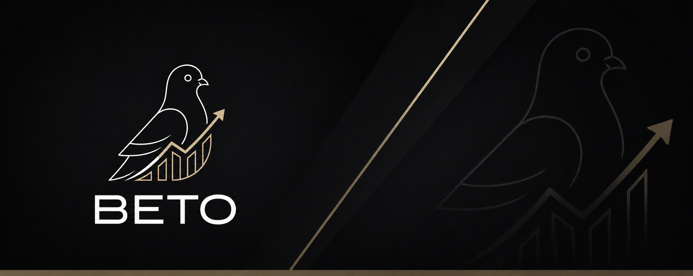

  

# Lucas André Miguel

### Suporte Técnico&nbsp;|&nbsp;Estudante de Sistemas de Informação&nbsp;|&nbsp;Full-Stack: React, Node.js, NestJS, TypeScript

📍 Francisco Beltrão, Paraná, Brasil

 

## 👋 Sobre mim

Estudante de Sistemas de Informação e desenvolvedor full-stack em formação, com foco em JavaScript/TypeScript. Desenvolvo soluções web e mobile com **React**, **Expo** e **NestJS**, aplicando boas práticas como Clean Architecture e testes automatizados com Jest. Tenho experiência prática em bancos de dados relacionais e não-relacionais via **Supabase** e **Firebase**, e atuo com metodologias ágeis (Scrum e Kanban) e fluxos de CI/CD.

🎯 Atualmente atuo com suporte técnico na MGS Sistemas de Informação e busco minha **primeira oportunidade como desenvolvedor full-stack júnior**.

 

## 🛠️ Tecnologias

 

## 📌 Projetos em destaque

| Projeto | Descrição | Stack |
|---|---|---|
| [**encontre_saude**](https://github.com/senac-pr-fb/encontre_saude) | Projeto de sistema de saúde construido em equipe (Senac), com autenticação e backend via Supabase | JavaScript |
| [**popular_da_copa**](https://github.com/lucasandre46/popular_da_copa) | App mobile com temática da copa do mundo 2026 (Expo/React Native) com autenticação Firebase e SQLite, seguindo desing feito no Figma(https://www.figma.com/design/kkunVS4d02G9ciTTQZP3RB/Beto?node-id=319-731&t=0iftUjI6TAxV18Re-1) | TypeScript |
| [**bto_api**](https://github.com/lucasandre46/bto_api) | Backend/API (NestJS) do projeto BTO, com autenticação segura | TypeScript |
| [**bto_coins**](https://github.com/lucasandre46/bto_coins) | Frontend (React + Vite) do projeto BTO corretora de ações e criptomoedas, com autenticação via Supabase | JavaScript |
| [**api_relatos_aleatorios**](https://github.com/lucasandre46/api_relatos_aleatorios) | API REST do sistema de relatos aleatórios | TypeScript |
| [**Front_Relatos_Aleatorios**](https://github.com/lucasandre46/Front_Relatos_Aleatorios) | Frontend (React + Vite) do sistema de relatos aleatórios | JavaScript |

 

## 🔮 Projetos futuros

| Ideia | Descrição | Status |
|---|---|---|
| BTO Coins versão mobile | Ferramentas: Expo + NestJS + Prisma, Desing (Figma): https://www.figma.com/design/kkunVS4d02G9ciTTQZP3RB/Beto?node-id=0-1&t=0iftUjI6TAxV18Re-1 | Planejado |
| Portfólio 2.0 | Nova versão do portfólio pessoal, com Next.js | Planejado |

 

## 🏆 Participações em eventos de tecnologia

- 🚀 Inovathon Sudovalley 2026
- 🧠 Olimpíadas Brasileiras de Tecnologia (OBT)
- 💡 Maratona de Ideação da Via Tecnológica do Leite

 

## 📫 Contato

